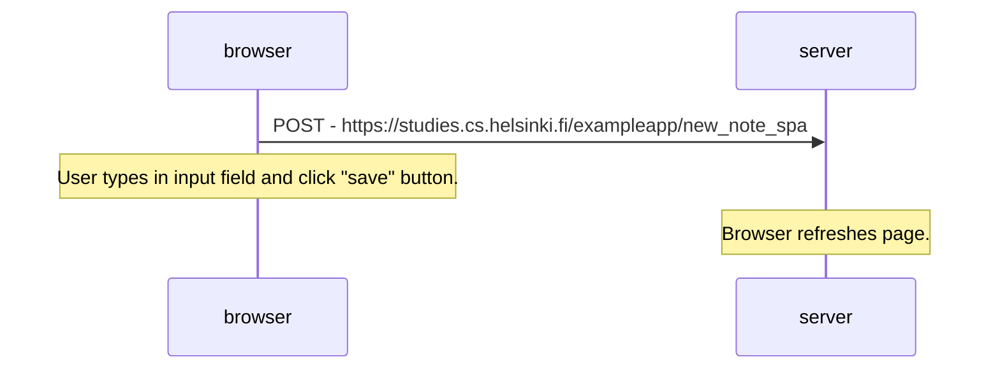

New Note Created in SPA

 

What occurs between browser and server when you type a new note and click the save button, on the Single Page App,

```mermaid

sequenceDiagram
    browser->>server: POST - https://studies.cs.helsinki.fi/exampleapp/new_note_spa
    Note over browser: User types in input field and click "save" button.
    Note over server: Browser refreshes page.


```
